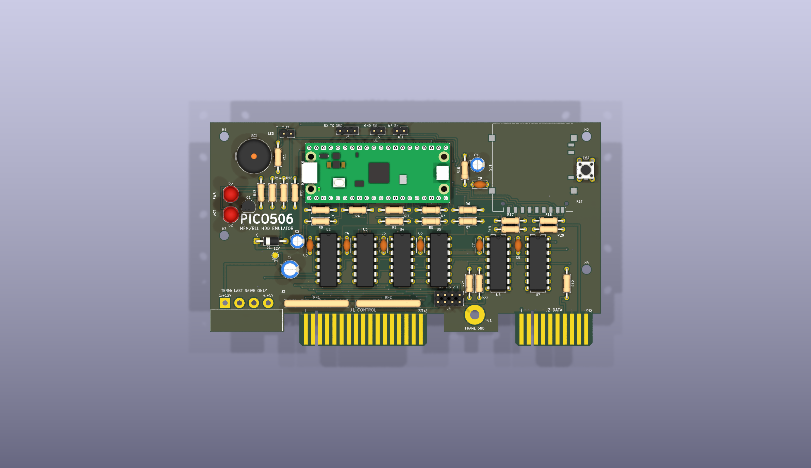
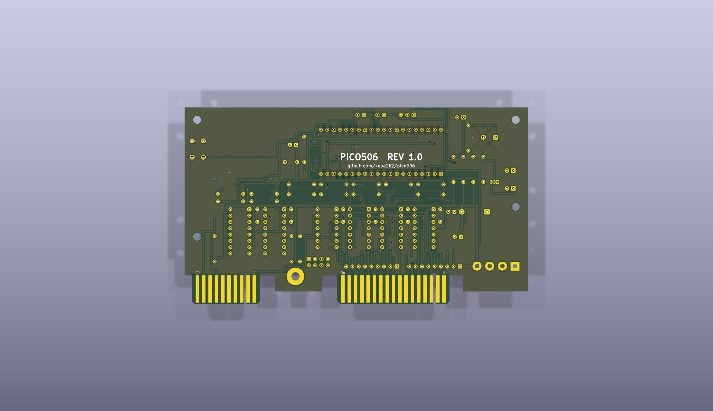

# Pico506 hardware — rev 1.0

A dedicated PCB for the Pico506 ST-506/MFM/RLL hard drive emulator: two-layer,
138 × 74 mm, all through-hole, with real card-edge tabs so it plugs into a
period ST-506 control/data cable pair the same way an ST-225 does.

**This repository is the board only.** The emulator itself — the RP2040 firmware,
the PIO signal generation, the SD card image format, and the explanation of how
any of it works — is Kuba Szczodrzyński's
[**kuba2k2/pico506**](https://github.com/kuba2k2/pico506). Read that first; this
board is useless without it. Kuba's write-up
[*Emulating a 1987 proprietary RLL hard drive*](https://kuba.szczodrzynski.pl/posts/toshiba-t1200/rll-hdd-emulator/)
is the long-form story of the project and the reference for the interface
behaviour this layout is built around.

This file covers the board: what to buy, how to strap it, and what to tell
the fab. See [Credits](#credits) for what is original here and what is not.

> **Status:** schematic and layout are complete and clean — ERC 0, DRC 0 at
> `--severity-all` (see [`erc.txt`](erc.txt), [`drc.txt`](drc.txt)).
> **It has not been fabricated or brought up yet.** Nothing here has been
> validated against real hardware; treat rev 1.0 as a first spin.

| Front | Back |
|---|---|
|  |  |

Also in [`doc/`](doc/): an isometric render, front/back layer PDFs, gerbers +
Excellon (`pico506-gerbers.zip`), a CSV BOM and a placement file. The schematic
PDF is [`pico506-sch.pdf`](pico506-sch.pdf).

## Bill of materials

36 line items, 62 parts, nothing surface-mount and nothing exotic. Quantities
and designators below are generated from the schematic — the machine-readable
copy is [`doc/pico506-bom.csv`](doc/pico506-bom.csv).

### Semiconductors

| Ref | Qty | Value | Notes |
|---|---|---|---|
| U1 | 1 | Raspberry Pi Pico | Pico or Pico W, THT header or castellated. The footprint takes either. |
| U2, U3 | 2 | 74LS05 | Hex inverter, **open collector**. Not 7404 — the open-collector output is what lets the terminated 5 V bus idle high. |
| U4, U5 | 2 | 7438 | Quad NAND, **open collector**, buffered. Plain `7438` (or `74S38`) is preferred over `74LS38`: the LS part sinks 24 mA where the bus wants 40 mA to hold a 220/330-terminated line at a valid low. 74LS38 will usually work with one drive on a short cable; use 7438 if you want spec margin. |
| U6 | 1 | AM26LS31CN | Quad RS-422 differential **driver** (READ data out). |
| U7 | 1 | MC3486N | Quad RS-422 differential **receiver** (WRITE data in). **AM26LS32AC** is a drop-in alternative and is usually easier to find. |
| Q1 | 1 | 2N3904 | LED sink for the front-panel activity LED. Any small NPN. |
| D1 | 1 | 1N5817 | Schottky, feeds the Pico's VSYS from +5 V. A 1N5819 or SS14-class part is fine; don't substitute a plain 1N400x — the forward drop leaves too little VSYS headroom. |
| D2 | 1 | LED 5 mm amber | `ACT` — activity. |
| D3 | 1 | LED 5 mm green | `PWR` — power. |

### Passives

| Ref | Qty | Value | Notes |
|---|---|---|---|
| RN1 | 1 | 220 Ω SIP-9 | Terminator pull-up half. **Bourns 4609X-101-221** (bussed, 8 resistors, common pin 1). Fit in a 9-pin SIP socket — see [Termination](#termination). |
| RN2 | 1 | 330 Ω SIP-9 | Terminator pull-down half. **Bourns 4609X-101-331**. Also socketed. |
| R21 | 1 | 220 Ω | Fixed 220/330 divider on the *selected* drive-select line, after the J4 jumper — the way an ST-225 does it. Not removable. |
| R22 | 1 | 330 Ω | ” |
| R1–R9, R16 | 10 | 1 kΩ | R1–R9 pull the 74LS05 open-collector outputs up to +3V3 for the Pico. R16 is the PWR LED resistor. |
| R10, R14, R15 | 3 | 470 Ω | R10 is the WRITE FAULT input pull-up; R14/R15 are the ACT LED resistors (on-board and front-panel). |
| R11, R12 | 2 | 100 Ω | R11 buzzer series, R12 terminates the WRITE differential pair across U7's inputs. |
| R13 | 1 | 4.7 kΩ | Q1 base. |
| R17–R20 | 4 | 10 kΩ | SD card SPI pull-ups. |
| C1 | 1 | 100 µF 16 V | Bulk on +5 V. Radial, 6.3 mm body, 2.5 mm pitch. |
| C2 | 1 | 22 µF 16 V | Bulk on VSYS. Radial, 5 mm body. |
| C3–C9 | 7 | 100 nF | Ceramic disc, 5 mm pitch. One per logic IC (C3–C8) plus one for the SD socket (C9). |
| C10 | 1 | 10 µF 16 V | +3V3 bulk next to the SD socket. |

All resistors are 1/4 W axial on a 10.16 mm (0.4 in) footprint — the classic
DIN0207 body with the leads bent out, so they lie flat.

### Connectors and mechanical

| Ref | Qty | Part | Notes |
|---|---|---|---|
| J1 | — | ST-506 control, 34-pin card edge | Etched into the board. Mates a 3M 3463 / AMP 88373-3 style IDC card-edge socket. |
| J2 | — | ST-506 data, 20-pin card edge | Etched into the board. Mates 3M 3461 / AMP 88373-6. |
| J3 | 1 | **AMP/TE 350211-1** 4-pos MATE-N-LOK | Cable side is **AMP 1-480424-0** with 350550-series pins. This is the standard 4-pin drive power connector. The footprint expects the vertical header with its legs formed 90° for rear entry — exactly what Seagate did — or use a right-angle MATE-N-LOK equivalent. |
| FG1 | 1 | **AMP 61761-2** faston tab | Frame ground, 0.187 in tab, 3.3 mm hole. Or just bolt a ring lug through it. |
| SD1 | 1 | **Hirose DM1AA-SF-PEJ(82)** | Full-size push-push SD socket. The card ejects over the board's front edge. |
| SW1 | 1 | 6 mm tactile switch, 4.3 mm | `RST` — pulls the Pico's RUN low. |
| J4 | 1 | 2×4 pin header, 2.54 mm | Drive select. See [Straps](#straps-and-jumpers). |
| J5 | 1 | 1×3 pin header | UART console: GND / TX / RX. |
| J6 | 1 | 1×2 pin header | `SERVO GATE` — 3.3 V logic, JVC RLL drives only. |
| J7 | 1 | 1×2 pin header | Front-panel activity LED: pin 1 anode, pin 2 cathode. |
| JP1 | 1 | 1×2 pin header | `WF EN` — WRITE FAULT enable. |
| TP1 | 1 | test pad | +12 V, so you can confirm the rail without probing the connector. |
| H1–H4 | 4 | M3 | 3.2 mm mounting holes. |
| — | 6 | DIP socket | 4 × DIP-14, 2 × DIP-16. Optional but recommended. |
| — | 2 | SIP-9 socket | For RN1/RN2, so the terminator can come out. **Not optional** if this drive might sit mid-chain. |

## Straps and jumpers

### J4 — drive select

The silkscreen reads `DS 4 3 2 1` left to right (west to east). Each column is
one J1 drive-select line on its odd pin and the shared `DS_SEL_N` node on its
even pin; fitting a shunt across one column selects that drive address.
**Fit exactly one shunt.**

| Column | J1 pin | Selects |
|---|---|---|
| `1` (east) | 26 | DS1 |
| `2` | 28 | DS2 |
| `3` | 30 | DS3 |
| `4` (west) | 32 | DS4 |

Which one you want depends on your controller's cable. With a straight-through
control cable, the first drive is DS1. With an **IBM-style twisted control
cable** the twist reassigns the select lines between the two drive connectors,
and the drive on the end (twisted) connector wants **DS2** — that is the
intended default for this board. Check your controller's manual: this is the
single most common reason an otherwise-working drive is not detected.

Downstream of the shunt, `DS_SEL_N` carries its own fixed 220/330 divider
(R21/R22), matching ST-225 practice — that termination stays fitted regardless
of chain position.

### Other headers

| Header | Fitted | Effect |
|---|---|---|
| JP1 `WF EN` | open (default) | WRITE FAULT is not driven; the line idles inactive via R10. |
| JP1 `WF EN` | closed | Firmware drives WRITE FAULT from GP22. Only close this if your firmware build actually asserts it. |
| J6 `SERVO GATE` | — | 3.3 V SERVO GATE for JVC JD-3824-class RLL drives. Leave unconnected for ordinary MFM. |
| J7 `FRONT LED` | — | Parallels the on-board ACT LED to a panel LED. Pin 1 is the anode. |
| J5 `UART` | — | Console at GND/TX/RX. 3.3 V logic — do not connect a 5 V TTL adapter. |

## Termination

ST-506 is a daisy chain, and the spec puts a 220 Ω/330 Ω divider on every
control input — but **only on the drive at the far end of the cable.** Every
other drive on the chain must have its terminator removed, or the lines are
loaded several times over and nothing reads reliably.

That is what RN1 (220 Ω) and RN2 (330 Ω) are, and it is why they belong in
sockets:

- **Last drive on the control cable** (or the only drive): RN1 and RN2 fitted.
- **Any other position:** pull both packs out.

The silkscreen says `TERM: LAST DRIVE ONLY` next to them as a reminder. The
data cable (J2) is point-to-point and needs no such choice — the WRITE pair's
terminator (R12) is soldered down.

## Connectors and keying

Both card-edge tabs stand 5 mm proud of the main outline, are 1.6 mm thick, and
carry a **0.914 mm key slot routed 12.5 mm in from the tab tip, between pins 4
and 6** — the standard ST-506 keying, so a connector cannot be seated
backwards. Odd pins are on the front (F.Cu) face, even pins on the back, at
2.54 mm pitch; fingers are 1.40 mm wide and 11.43 mm long with the copper
pulled back 0.45 mm from the routed tip.

### Relief cut-outs

The fingers are 11.43 mm long but the tab only stands 5 mm proud, so the board
is cut away **beside** each tab as well — otherwise the mating socket's shell
hits the main board edge after 5 mm with two thirds of the finger length still
unengaged. Each relief runs inboard to y = 67.57 mm, level with the finger
tops, giving a free-standing tongue exactly as long as the gold:

| Relief | Width | Note |
|---|---|---|
| J1 west | **5.34 mm** | Limited by the J3 power housing 0.6 mm further west, not by choice — see below. |
| J1 east | 6.00 mm | |
| J2 west | 6.00 mm | |
| J2 east | 2.90 mm | The board simply ends here; the whole south-east corner is removed, so there is nothing east of the J2 tab to foul. |

The overall envelope is unchanged — 138 × 74 mm plus the 5 mm tabs — so this
costs nothing mechanically.

> **Check this against your actual sockets.** The J1 relief can only be
> 5.34 mm wide on its west side, because the J3 power connector housing (a full
> 1.00 in wide, its east face at x = 25.62 mm) is immediately beyond it. If
> your J1 socket needs more than that, the obstruction is the *power connector
> body*, not the board, and the fix is to shift J3 east — which moves it off the
> measured ST-225 position. `TAB_RELIEF_W` in
> [`tools/layout.py`](tools/layout.py) is the single knob for relief width.

Extending the tabs further instead of notching would also work and is a
one-constant change (`TAB_PROTRUDE`), but it moves every finger pad south,
invalidates all the hand-routed finger escapes, and grows the board's depth
past the drive's rear plane.

Lateral positions follow the measured ST-225 arrangement so ordinary cable
dressing just works. Measured from the board's west edge:

| Tab | Centre | Width | Pins |
|---|---|---|---|
| J1 control | 54.10 mm | 45.09 mm | 34 |
| J2 data | 121.45 mm | 27.30 mm | 20 |

J1 uses the ST-506/412 control pinout (even pins signal, odd pins ground); J2
uses the ST-412 data pinout, with the two differential pairs on 13/14 (WRITE)
and 17/18 (READ). Both are enumerated in
[`tools/netlist.py`](tools/netlist.py), which is the single source of truth for
the whole design.

J3 power is the usual 4-pin order: **pin 1 = +12 V**, pins 2 and 3 ground,
**pin 4 = +5 V**, marked on the silkscreen. +12 V is not used by the emulator —
it is brought to TP1 only so you can verify the supply.

## Mechanical

Everything below is from [`tools/layout.py`](tools/layout.py); the origin is the
board's north-west corner viewed from the component side.

- **Main outline:** 138.0 × 74.0 mm, 1.6 mm FR4. The rear (south) edge is the
  drive's rear plane; the two card-edge tabs protrude 5 mm past it for cable
  access, with 1 mm 45° corner cuts at the tab tips. The board is notched
  beside each tab so the sockets can seat — see
  [Relief cut-outs](#relief-cut-outs). The south-east corner is cut away
  entirely as part of that.
- **Mounting holes** (3.2 mm, M3): H1 (5, 5), H2 (133, 5), H3 (5, 40),
  H4 (133, 52).
- **Frame ground** faston FG1 sits between the two tabs, 6 mm in from the rear
  edge at x = 93.5.
- **SD card** ejects over the *front* (north) edge — leave that edge clear in
  any enclosure.
- **USB** and the `RST` button are the other two things you will want access
  to: USB is at the Pico's west end, `RST` at the east edge.

If you are building an enclosure or a bay adapter: this board is not a
mechanical drop-in for a 3.5 in or 5.25 in drive. It reproduces the *electrical
and connector* geometry of an ST-225 rear face, not its chassis. On a real
drive the card-edge mid-plane sits roughly 4.8 mm above the bay floor; if you
want the cables to land where a drive's would, that is the dimension to match,
and SFF-8501 gives the bay hole pattern to mount against. The four holes here
are a generic rectangle, not the SFF pattern — pick them up with standoffs.

## Fab notes

Two layers, 1.6 mm FR4, 1 oz copper, minimum track 0.2 mm and minimum
clearance 0.18 mm — comfortably inside every cheap prototype service's
capability. Two things are *not* default, though, and both matter:

1. **Card-edge fingers need hard gold.** Selective ENIG or hard gold plating on
   the tabs, Ni ≥ 2.5 µm / Au ≥ 0.4 µm. HASL fingers will wear through and
   go intermittent. This is usually a paid option — say "gold fingers".
2. **Bevel the tabs, 30°, both faces, on both card edges.** Without the bevel
   the tabs are hard to insert and will chew the connector.

Also: the key slots are 0.914 mm routed slots cut right through, so the fab
needs to treat them as internal routing, not drills — as are the four relief
notches beside the tabs. All of it is on `Edge.Cuts`; the two plating notes are
written onto the `Cmts.User` layer of the board so they travel with the gerbers.

## Assembly order

Low parts first, and leave the socketed parts until you have tested the rails:

1. Diodes, resistors, resistor packs' sockets, IC sockets.
2. Ceramics, then electrolytics (watch polarity on C1/C2/C10 and D1's band).
3. Headers, SW1, SD socket, LEDs, buzzer, Q1.
4. J3 power and the FG1 faston.
5. **Before fitting any IC:** apply drive power and check +5 V, +3V3 (Pico
   fitted), +12 V at TP1, and that nothing is warm.
6. Fit the Pico, then the logic ICs, then RN1/RN2 if this is the last drive.
7. Set the J4 shunt for your controller's cable before first use.

## Regenerating the design

The schematic and board are **generated**, not hand-drawn —
[`tools/netlist.py`](tools/netlist.py) is the single source of truth and both
generators consume it. Do not edit the `.kicad_sch` or `.kicad_pcb` by hand;
your changes will be overwritten.

```bash
cd tools
python3 gen_sch.py ../pico506.kicad_sch   # schematic (+ writes sch_uuids.json)
python3 gen_footprints.py                 # project footprint library
./check.sh                                # board + zone fill + full DRC
./export.sh                               # renders, PDFs, gerbers, BOM
```

`check.sh` regenerates the board, fills the zones, re-stamps the `.kicad_pro`
(pcbnew's save clobbers it) and runs `--severity-all` DRC into
[`drc.txt`](drc.txt). It also surfaces the generators' own warnings — a
failed ground link or an unrouted net shows up there long before you notice it
as "unconnected items" in DRC.

Two analysis helpers, both needing KiCad's bundled python
(`/Applications/KiCad/KiCad.app/Contents/Frameworks/Python.framework/Versions/Current/bin/python3`):

- **`tools/stitch.py`** — walks the GND pour, unions every ground island with
  the tracks, vias and pads that touch it, and reports any fragment the main
  plane does not reach, along with a ready-to-paste fix (stitch via, bridge
  track, or a pad-to-pad link). This is how the ground plane got from six
  orphaned fragments — including floating IC ground pins — to a single
  connected plane. **Re-run it after any routing or placement change**: the
  coordinate-based entries in `GND_STITCH_VIAS` go stale as soon as the maze
  router lands differently, and a stale via can end up sitting on a signal
  track.
- **`tools/place_check.py`** — reports courtyard boxes and how deeply
  overlapping pairs interpenetrate, so a placement nudge can be sized instead
  of guessed.

### Things that will bite you

- **Some ground pads cannot be rescued after routing.** The inter-DIP corridors
  seal once the signal router fills them, and several have no B.Cu pour beneath
  to via down to. Those rescues (`GND_STUBS` in `gen_pcb.py`) are routed *as
  first-class nets inside the router's search*, so a pass only counts if the
  signals and the ground links both fit. Moving one to a post-routing pass will
  silently strand a decoupling cap's ground.
- **`router.CLR` is 0.24 mm against a 0.18 mm rule.** The slack absorbs a
  route's closest approach between grid cells. Raising it to 0.25 leaves the
  U3/U4 corridor one track short of holding both the signals and C5's ground
  rescue; lowering it starts producing real clearance violations.
- **R10 must stay at x = 90.** The WRITE-FAULT riser threads between the +3V3
  trunk descent at x = 87.9 and R10's pad column; that gap is what fits.
- **Reference designators are placed automatically** (`place_references()` in
  `gen_pcb.py`), by trying positions around each part and taking the first that
  clears every mask aperture, all footprint silk, the board texts and the board
  edge. Don't hand-place them — adjust the candidate list instead.
- **`lib_footprint_mismatch` is set to `ignore`** in the project file. The board
  is regenerated from the libraries every build, so "the board copy has drifted
  from the library" cannot happen the way it can on a hand-edited board. KiCad
  flags U1 anyway; its pads, graphics, zones and attributes all compare
  identical, and the residual difference is bookkeeping that survives a pcbnew
  load/save round-trip. Every other rule is at its default severity.

Longer-form layout history and the routing plan are in
[`tools/ROUTING_PLAN.md`](tools/ROUTING_PLAN.md).

## Credits

The Pico506 emulator is by **Kuba Szczodrzyński** —
[kuba2k2/pico506](https://github.com/kuba2k2/pico506), described at length in
[*Emulating a 1987 proprietary RLL hard drive*](https://kuba.szczodrzynski.pl/posts/toshiba-t1200/rll-hdd-emulator/).
That project is the emulator: the firmware, the PIO signal generation, the
level-shifter/inverter circuit this board's logic section is a direct
descendant of, and the pin assignment the whole layout is wired to. Without it
there is nothing to put on a PCB.

What this repository adds is the board itself: the schematic capture, the
two-layer layout, the ST-506 card-edge tabs and their ST-225-derived geometry,
the project footprint library, and the Python generators in
[`tools/`](tools/) that produce all of it. Bugs in the board are mine, not
upstream's.

Also drawn on: the [ST-506/ST-412 interface](https://en.wikipedia.org/wiki/ST-506/ST-412)
pinouts and the 220/330 termination and drive-select conventions from Seagate's
ST-225 documentation, and the [HDD Clicker](https://www.vogons.org/viewtopic.php?t=90047)
for the buzzer idea that upstream implements.

## Licence

[GNU General Public License v3.0](LICENSE) — the same licence as upstream, so
the board and the firmware it exists to carry stay under the same terms.

Copyright © 2026 Henry Merrett (this PCB: schematic, layout, footprints and
generators).
Copyright © 2025 Kuba Szczodrzyński (Pico506, from which this board's circuit
is derived).

This is a hardware design under a software licence, which is how upstream is
licensed and therefore what a derivative here has to be. In practice: the
design files are the "source", and if you fabricate, modify or distribute the
board you owe the recipients those files under the GPL. There is no warranty,
and note that **rev 1.0 has never been fabricated** — see the status note at
the top.
